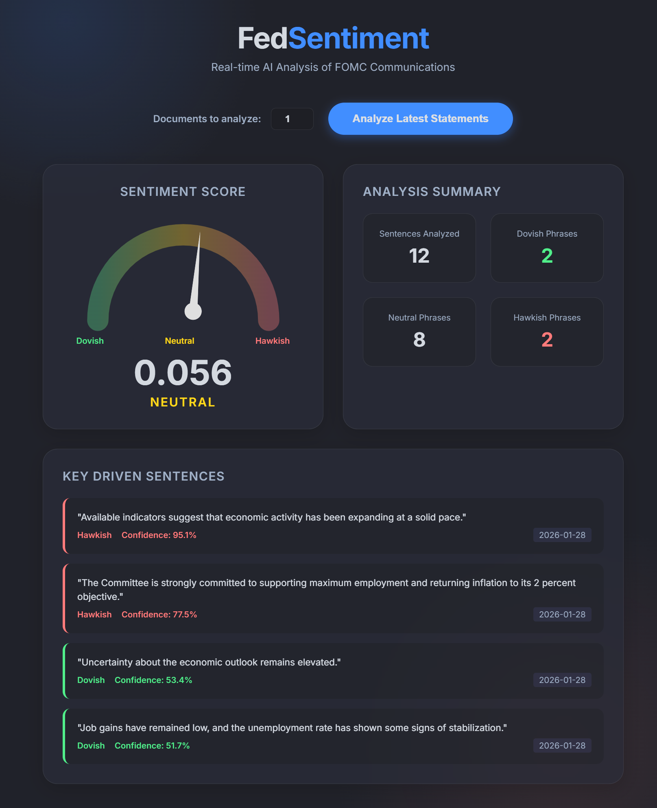

# Fed Sentiment Analyzer

Fed Sentiment Analyzer is a FastAPI-based web application that analyzes the sentiment of recent Federal Open Market Committee (FOMC) statements. 

It scrapes the latest monetary policy releases directly from the Federal Reserve website, processes the text into sentences, and runs them through a specialized financial NLP model ([`ProsusAI/finbert`](https://huggingface.co/ProsusAI/finbert)). It calculates a balanced Hawkish/Dovish score and highlights the most impactful statements, providing traders and analysts with an instant, bias-free read on Fed policy direction.

## Features
- **Live Scraping**: Dynamically fetches the latest FOMC statements from the Federal Reserve calendar.
- **Financial NLP**: Utilizes [`ProsusAI/finbert`](https://huggingface.co/ProsusAI/finbert) to accurately classify economic strength as Hawkish and weakness as Dovish.
- **Sentiment Dial**: A sleek, glassmorphic UI featuring a real-time dial indicating the aggregate hawkish/dovish lean.
- **Blended Highlights**: Extracts the top 3 most Hawkish and top 3 most Dovish sentences for a balanced summary.
- **Source Attribution**: Provides direct links to the original Fed statements for verification.

## Setup
1. Clone the repository.
2. Create a virtual environment: `python -m venv venv`
3. Activate the environment: `.\\venv\\Scripts\\activate` (Windows) or `source venv/bin/activate` (Mac/Linux).
4. Install dependencies: `pip install -r requirements.txt`
5. Run the server: `python app.py`
6. Open your browser and navigate to `http://localhost:8000`.

## Tech Stack
- **Backend:** Python, FastAPI, Uvicorn
- **NLP / ML:** HuggingFace Transformers, PyTorch, NLTK
- **Scraping:** Requests, BeautifulSoup4
- **Frontend:** HTML, Vanilla CSS (Glassmorphism), JavaScript

## Disclaimer
**For Educational Purposes Only.** The information provided by FedSentiment does not constitute investment advice, financial advice, trading advice, or any other sort of advice. You should not treat any of the application's outputs as such. Do conduct your own due diligence and consult your financial advisor before making any investment decisions. The creators of this software are not responsible for any financial losses or damages incurred as a result of using this application.
